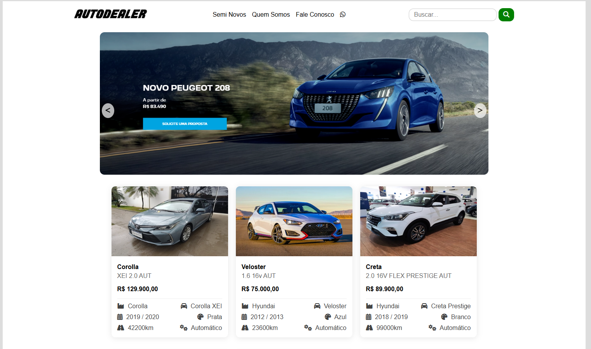

# 🚗 Desafio Autoforce

Este é uma página de anúncio para veículos seminovos de um cliente, feita com **Ruby on Rails**, **React**, **HTML**, **CSS**, **JavaScript**, e ícones do **Font Awesome**. Ele apresenta carros em cards com informações detalhadas e um formulário de contato simples.
---

## Dificuldades e Aprendizados
Minha primeira reação ao iniciar o projeto foi: "Como vou fazer esse carrossel de imagens?" e "Como vou usar React aqui".Portanto , decidi dividir o projeto em partes.

Comecei escolhendo como referência o layout da página [Autódromo Dealer Seminovos](https://testes.autodromo.app/dealer-seminovos/) e a partir disso, estruturei a aplicação em três seções principais: header, body e footer.

Como já tinha alguma experiência com cabeçalhos e rodapés, optei por começar por eles. Isso me deu mais confiança antes de enfrentar a parte mais complexa: o body com o carrossel e os cards.

Para o carrossel de imagens, decidi inicialmente exibir três imagens e usar JavaScript para alternar entre elas com display: block/none em intervalos de 5 segundos. Tive dificuldade em alinhar os botões de navegação e fazer com que eles funcionassem corretamente.

Depois, parti para os cards de veículos. O maior desafio aqui foi alinhar os elementos e apresentar todas as informações de forma clara, minimalista e esteticamente agradável.

Em seguida, pensei em como incluir o React de forma simples, mas funcional. A solução foi criar o botão "Fale Conosco", que serve como link para o formulário de contato, implementando um componente React para esse trecho da página. Tentei fazer o formulario com react mas sem sucesso.

Outro aprendizado valioso foi sobre responsividade. Ao testar a página em dispositivos móveis, percebi que elementos como a navbar e o footer não estavam se adaptando bem. Investiguei como deixá-los responsivos e entendi melhor o uso de flex-wrap, media queries e organização de layout com CSS moderno.

## Links de Referencia
 -  [Componentes React](https://mui.com/material-ui/getting-started/installation/)
 -  [Rails + React](https://www.youtube.com/watch?v=Spn9bOVyBVY)
 -  [Formulario Rails](https://guides.rubyonrails.org/getting_started.html)
 -  [Deploy no Render]( https://render.com/docs/deploy-rails-6-7)

## ✨ Funcionalidades

- Exibição de cards de veículos com marca, modelo, ano, cor, quilometragem e valor.
- Formulário de contato funcional.
- Layout responsivo para mobile.
- Ícones com Font Awesome.
- Barra de navegação e rodapé estilizados.
- Links para páginas "Semi Novos", "Quem Somos" e "Fale Conosco".
- Links para redes sociais: WhatsApp, Instagram, Facebook e YouTube.

---

## 🛠 Tecnologias Utilizadas

- Yarn 1.22
- Node.js 18.20
- Ruby 3.2.2
- Rails 7.1
- HTML5 / CSS3
- JavaScript (ES6+)
- React 19
- MUI (Material UI)
- Font Awesome

---

## 📸 Captura de Tela

---

## 🚀 Como rodar o projeto localmente

### Pré-requisitos

- Ruby >= 3.2.2
- Node.js >= 18
- Yarn >= 1.22
- Bundler

### Passos:

1. Clone o repositório:

- git clone git@github.com:SSantos425/desafio-autoforce.git
- cd desafio-autoforce
- bundle install
- bin/dev
